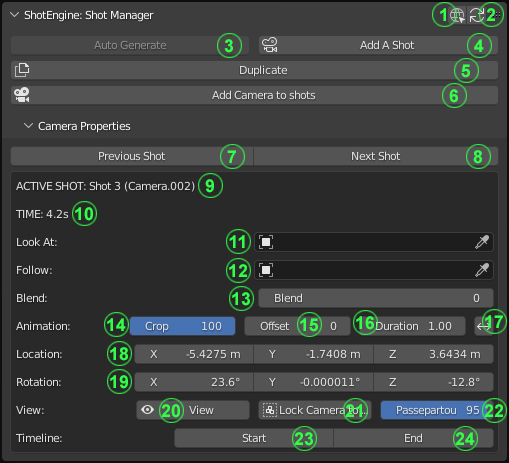
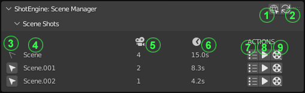
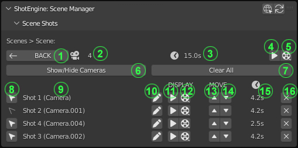
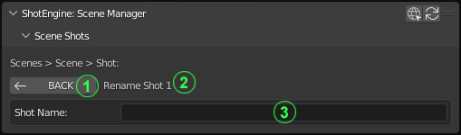

==========================================================
ShotEngine: Your Ultimate Scene Shot Organizer and Manager
==========================================================
https://www.youtube.com/@RusselStudiosOfficial

:Version: 1.0.0

.. contents::

Introducing ShotEngine, the ultimate tool designed to revolutionize the way you organize and manage shots in your Blender scenes. Say goodbye to the hassle and welcome a seamless experience! Inspired by Unity's Cinemachine, ShotEngine gives you full control and effortless organization over your scene shots. From creation to management, this powerful tool empowers you to streamline your workflow with ease. With its intuitive interface and robust features, ShotEngine lets you effortlessly arrange, reorder, blend between shots and fine-tune your shots to perfection. In addition, ShotEngine provides a range of tools for previewing and rendering individual shots, modifying the speed and length of shots, reversing and offsetting shot animations, duplicating shots, and auto-generating shots from cameras with animations.

Take charge of your creative vision and bring your scenes to life like never before. Discover the efficiency, organization, and precision you've always desired with ShotEngine - the indispensable companion for all your shot-related endeavors.

Getting Started
===============
This guide will help you get up and running with this powerful tool for organizing and managing your scene shots in Blender. Whether you're working on an animation, film, or any other project that involves shots, ShotEngine will streamline your workflow and bring efficiency to your creative process.

Requirements 
------------
Blender version 2.80+

Installation
------------
1. Download the ShotEngine addon file.
2. Launch Blender and go to Edit -> Preferences.
3. In the Preferences window, navigate to the Add-ons tab.
4. Click on the "Install" button and locate the downloaded ShotEngine addon file.
5. Select the file and click "Install Add-on" to install it.
6. Once installed, make sure the checkbox next to ShotEngine is enabled.

Features
--------
1. Create shots
2. Add **custom cameras** to shots
3. **Duplicate** shots
4. **Rename** shots
5. Set object to **follow**
6. Set object to **track to**
7. **Blend** between multiple shots to create smooth and seamless transitions
8. Change the **speed/duration** of shots
9. **Crop** the camera animation of shot
10. **Reverse** camera animation of shot
11. **Offset** camera animation of shot
12. **Re-order** shot sequence
13. **Preview all** shots
14. **Preview individual** shots
15. **Batch-Render** all shots of a scene
16. **Render individual** shots
17. **Delete** shots
18. **Auto-Generate shots** from scene cameras
19. **Hide/Unhide** scene shots

User Interface
--------------
The ShotEngine panel is usually located in the sidebar (press N to toggle the sidebar if it's not visible).

The interface is divided into two main sections: "ShotEngine: Shot Manager" and "ShotEngine: Scene Manager", providing easy navigation and organization. Users can collapse either section when not in use. Below are detailed descriptions to provide a clearer understanding of the interface and functions of each element.

ShotEngine: Shot Manager
========================

Main Interface
--------------

1. **ShotEngine Documentation:** Access the online documentation for the ShotEngine Addon.
2. **Update Shots:** Refresh and update the scene shots.
3. **Auto Generate Shots:** Automatically generate shots based on the cameras in the scene that have at least two keyframes. (Available only when no shots exist in the scene)
4. **Add a Shot:** Create a new shot with the camera positioned at the current view in the 3D viewspace. The default duration for new shots is 100 frames.
5. **Duplicate a Shot:** Create a copy of the active shot. (Available only when a shot is selected and active)
6. **Add Selected Camera to Shots:** Add the selected camera to the list of shots. (Available only when the selected camera is not already included in the shots)

Camera Properties Interface
---------------------------

7. **View the Previous Shot:** Switch to the previous shot in the sequence. (Available only when there is a previous shot relative to the active shot)
8. **View the Next Shot:** Switch to the next shot in the sequence. (Available only when there is a next shot relative to the active shot)
9. **Name/Title of the Active Shot:** Displays the name of the currently active shot.
10. **Total Duration of the Active Shot:** Displays the total duration of the active shot in seconds (total frames divided by frames per second).
11. **Object to Look At:** Set an object for the shot camera to focus on or track to.
12. **Object to Follow:** Set an object for the shot camera to follow.
13. **Number of Frames to Blend:** Specify the number of frames used for blending between the current shot and the next shot. (Available only when there is a next shot relative to the active shot)
14. **Crop Camera Animation:** Trim the camera animation to a specific section. (Available only when the active shot's camera has keyframe animation)
15. **Offset Camera Animation:** Shift the camera animation to a specific section. (Available only when the active shot's camera has keyframe animation)
16. **Change the Duration of the Shot:** Adjust the length or duration of the active shot. (May result in slower or faster camera movements if the camera has keyframe animation)
17. **Reverse Camera Animation:** Reverse or flip the keyframes of the camera animation. (Available only when the active shot's camera has keyframe animation)
18. **Camera Location:** The X, Y, and Z euler coordinates of the shot camera.
19. **Camera Rotation:** The X, Y, and Z euler rotation of the shot camera.
20. **See through Camera:** View through the shot camera in the 3D viewspace.
21. **Lock Camera to View:** Lock the active camera to the current view.
22. **Passepartout/Camera Background Framing:** Adjust the opacity of the camera background framing.
23. **Jump to the Start of the Active Shot**
24. **Jump to the End of the Active Shot**

ShotEngine: Scene Manager
=========================

Main Interface
--------------

1. **ShotEngine Documentation:** Access the online documentation for the ShotEngine Addon.
2. **Update Shots:** Refresh and update the scene shots.
3. **Switch to Scene:** Switch to the selected scene.
4. **Scene Name/Title:** Displays the name/title of the scene(s).
5. **Number of Shots in the Scene:** Indicates the total number of shots for each scene.
6. **Total Duration of Shots in the Scene:** Displays the combined duration of all shots in the scene, measured in seconds.
7. **View Shot List:** Access the list of shots within the scene.
8. **Preview Shots:** Preview all shots within the scene.
9. **Batch Render Shots:** Render all shots within the scene together in a batch process.

When the **View Shot List** (7) is clicked, the interface below is shown.

Shots List
----------

1. **Back to the Main Interface:** Return to the main interface.
2. **Number of Shots in the Scene:** Indicates the total number of shots within the scene.
3. **Total Duration of Shots in the Scene:** Displays the combined duration of all shots in the scene, measured in seconds.
4. **Preview Shots:** Preview all shots within the scene.
5. **Batch Render Shots:** Render all shots within the scene together in a batch process.
6. **Show/Hide Cameras:** Toggle the visibility of all shots in the 3D View.
7. **Clear All Shots:** Remove all shots from the scene.
8. **Select Shot:** Choose a shot and activate its associated camera.
9. **Name/Title of the Shot:** Displays the name of the selected shot.
10. **Edit Name/Title of the Shot**
11. **Preview the Shot**
12. **Render the Shot**
13. **Move the Shot up the Sequence**
14. **Move the Shot down the Sequence**
15. **Total Duration of Shot:** Displays the total duration of the active shot in seconds (total frames divided by frames per second).
16. **Delete the Shot:** Remove the shot from the scene.

When the **Edit Name/Title of the Shot** (10) is clicked, the interface below is shown.

Rename Shot
-----------

1. **Back to the Shot List Interface:** Return to the Shot List interface.
2. **Current Shot Name/Title:** Displays the name of the currently active shot.
3. **New Shot Name Input:** Enter the new name for the shot.

Examples/Use cases
==================
Here are a few examples of how you might use the ShotEngine addon in your projects:

1. Create a set of cameras to use as reference images while modeling.
2. Switch between different cameras to preview your scene from different angles.
3. Use the rename feature to give your cameras descriptive names, making it easier to keep track of them in complex projects.
4. Preview and render individual shots by simply clicking on them, allowing you to quickly iterate on specific shots in your animation.
5. Adjust the speed and length of shots to fine-tune the timing of your animation.
6. Reverse and offset shot animations to create complex camera movements.
7. Re-order shots to change the sequence of your animation.
8. Duplicate shots to create variations of a shot without having to recreate the camera animation.
9. Auto-generate shots from cameras with animations to quickly create a set of shots from a complex camera animation.
10. Preview and render all shots with a single click to see the complete animation and create the final rendered version.

I hope this updated documentation example is helpful as you create your shots. If you have any further questions or need more guidance, don't hesitate to ask me via email(russelstudios@gmail.com)

Updates
=======
0.1.0 (16/6/23)
  **UPDATE:**   Options to Crop, Offset and Reverse have been extended to all Shots with keyframes.
  **FIXED:**   Shot "Start" and "End" keyframes are automatically set to starting and ending keyframes of the shot camera respectively.
  **FIXED:**   Shot animation data not altered upon duplicate.
    
    
